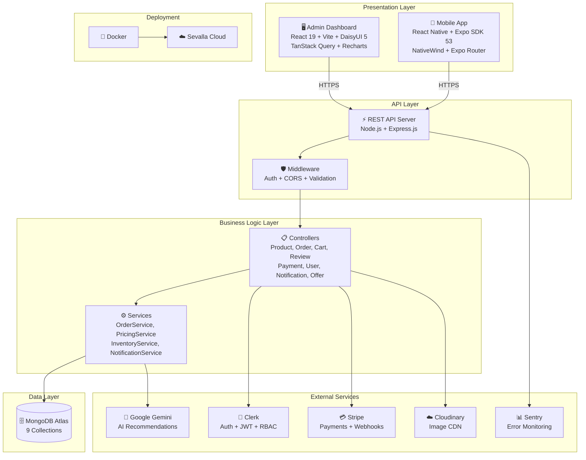
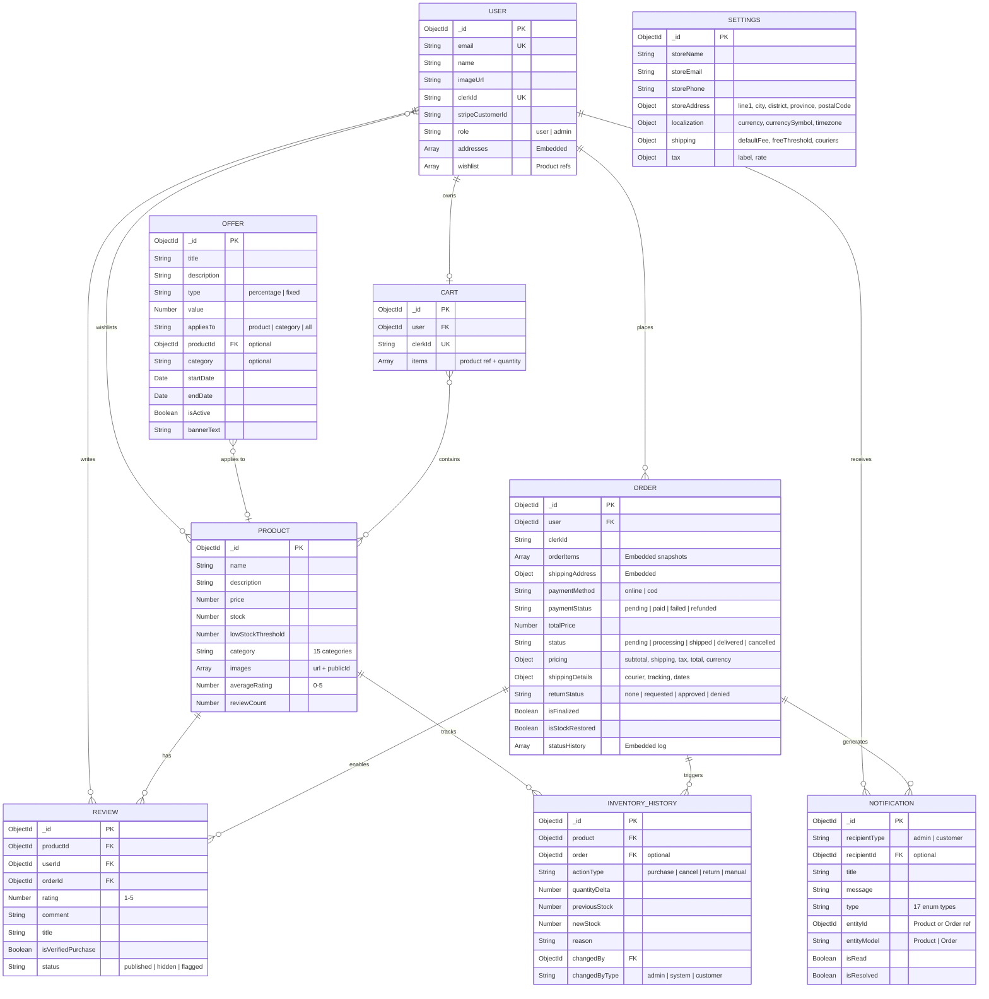

<p align="center">
  
  
  
  
  
  
  
  
</p>

# 🛒 SmartShop — Full-Stack E-Commerce Platform

> A production-grade, full-stack e-commerce ecosystem with a **React Admin Dashboard**, **React Native Mobile App**, and **Node.js Backend API** — localized for Sri Lanka (LKR currency, local shipping, address formats).

---

## 📐 System Architecture



---

## 👤 Use Case Diagram

```mermaid
graph LR
    subgraph "Actors"
        C["👤 Customer"]
        A["🔑 Admin"]
        S["⚙️ System"]
    end

    subgraph "Customer Use Cases"
        UC1["Browse Products"]
        UC2["Search & Filter"]
        UC3["View Product Details"]
        UC4["Manage Cart"]
        UC5["Manage Wishlist"]
        UC6["Checkout with Stripe"]
        UC7["Checkout with COD"]
        UC8["Track Orders"]
        UC9["View Digital Invoice"]
        UC10["Write Reviews"]
        UC11["Manage Addresses"]
        UC12["View Notifications"]
        UC13["Request Return/Refund"]
        UC14["Get AI Recommendations"]
    end

    subgraph "Admin Use Cases"
        UA1["Dashboard Analytics"]
        UA2["Manage Products (CRUD)"]
        UA3["Process Orders"]
        UA4["Update Shipping & Tracking"]
        UA5["Manage Offers & Promotions"]
        UA6["Moderate Reviews"]
        UA7["Monitor Inventory"]
        UA8["View Sales Reports"]
        UA9["Manage Customers"]
        UA10["Configure Store Settings"]
        UA11["Generate Documents"]
        UA12["Handle Returns/Refunds"]
        UA13["Mark COD as Paid"]
    end

    subgraph "System Use Cases"
        US1["Send Notifications"]
        US2["Process Webhooks"]
        US3["Track Inventory Changes"]
        US4["Calculate Dynamic Pricing"]
        US5["Generate Stock Alerts"]
    end

    C --> UC1
    C --> UC2
    C --> UC3
    C --> UC4
    C --> UC5
    C --> UC6
    C --> UC7
    C --> UC8
    C --> UC9
    C --> UC10
    C --> UC11
    C --> UC12
    C --> UC13
    C --> UC14

    A --> UA1
    A --> UA2
    A --> UA3
    A --> UA4
    A --> UA5
    A --> UA6
    A --> UA7
    A --> UA8
    A --> UA9
    A --> UA10
    A --> UA11
    A --> UA12
    A --> UA13

    S --> US1
    S --> US2
    S --> US3
    S --> US4
    S --> US5
```



---

## 🗄️ MongoDB Database Schema



---

## ✨ Features

### 📱 Mobile App (Customer-Facing)
| Feature | Description |
|---------|-------------|
| **Product Browsing** | Grid/list views with category filtering, search, and price ranges |
| **Product Details** | Image carousel, ratings, reviews, stock status, offer badges |
| **Smart Cart** | Add/update/remove items with real-time price calculation |
| **Wishlist** | Save products for later with quick add-to-cart |
| **Stripe Payments** | Secure online payments with Payment Sheet integration |
| **Cash on Delivery** | Alternative payment method for local orders |
| **Order Tracking** | Real-time status updates with logistics timeline |
| **Digital Invoices** | Auto-generated PDF invoices with share/export |
| **AI Recommendations** | Gemini-powered product suggestions |
| **Push Notifications** | Order updates, payment confirmations, delivery alerts |
| **User Profiles** | Address management (Sri Lankan format), order history |

### 🖥️ Admin Dashboard
| Feature | Description |
|---------|-------------|
| **Dashboard Analytics** | Revenue charts, order stats, real-time KPIs with Recharts |
| **Product Management** | Full CRUD with Cloudinary image uploads (up to 3 per product) |
| **Order Management** | Daraz-style logistics workflow (Pending → Shipped → Delivered) |
| **Inventory Alerts** | Low-stock notifications with configurable thresholds |
| **Customer Management** | User directory, order history, account details |
| **Offers & Promotions** | Product/category/store-wide discounts with scheduling |
| **Review Moderation** | Approve, flag, or remove customer reviews |
| **Sales & Inventory Reports** | Exportable analytics with date range filtering |
| **Restock Suggestions** | AI-driven restocking recommendations |
| **Document Generation** | Invoices, packing slips, shipping labels (PDF export) |
| **Store Settings** | Currency, tax, shipping, and address configuration |

### ⚙️ Backend API
| Feature | Description |
|---------|-------------|
| **RESTful Architecture** | Clean controller/service/model separation |
| **Clerk Authentication** | JWT-based auth with role-based access control |
| **Stripe Integration** | Payment intents, webhooks, refund processing |
| **Cloudinary CDN** | Image upload, optimization, and delivery |
| **Dynamic Pricing** | Offer engine with product/category/store-wide precedence |
| **Inventory Service** | Stock tracking, movement history, low-stock alerts |
| **Order Service** | State machine with finalization, cancellation, and returns |
| **Notification Service** | Multi-channel alerts for customers and admins |
| **Gemini AI Service** | Smart product recommendations |
| **Localization** | Sri Lankan currency (LKR), address format, shipping config |

---

## 📁 Project Structure

```
Final_Project/
├── backend/                    # Node.js + Express API Server
│   ├── src/
│   │   ├── config/             # Environment & database configuration
│   │   ├── controllers/        # Route handlers (10 controllers)
│   │   │   └── admin/          # Admin-specific controllers
│   │   ├── middleware/         # Auth, validation, error handling
│   │   ├── models/             # Mongoose schemas (9 models)
│   │   ├── routes/             # Express route definitions
│   │   ├── seeds/              # Database seeding scripts
│   │   ├── services/           # Business logic layer (5 services)
│   │   └── server.js           # Express app entry point
│   ├── Dockerfile              # Production Docker configuration
│   └── package.json
│
├── admin/                      # React Admin Dashboard
│   ├── src/
│   │   ├── components/         # Reusable UI components
│   │   ├── layouts/            # Dashboard layout with sidebar
│   │   ├── lib/                # API client, utilities, helpers
│   │   ├── pages/              # Page components (12 pages)
│   │   ├── App.jsx             # Root component with routing
│   │   └── main.jsx            # Entry point with providers
│   ├── Dockerfile              # Production Docker configuration
│   └── package.json
│
├── mobile/                     # Expo + React Native Mobile App
│   ├── app/                    # Expo Router file-based routing
│   │   ├── (tabs)/             # Tab navigation screens
│   │   ├── (profile)/          # Profile & settings screens
│   │   └── product/            # Product detail screens
│   ├── components/             # Shared UI components
│   ├── hooks/                  # Custom React hooks
│   ├── lib/                    # API client, utilities
│   ├── types/                  # TypeScript type definitions
│   └── package.json
│
├── .dockerignore               # Docker build exclusions
├── .gitignore                  # Git exclusions
├── package.json                # Root workspace configuration
└── README.md                   # This file
```

---

## 🚀 Getting Started

### Prerequisites

| Tool | Version | Purpose |
|------|---------|---------|
| **Node.js** | ≥ 18.x | Runtime environment |
| **npm** | ≥ 9.x | Package management |
| **MongoDB** | Atlas or local | Database |
| **Expo CLI** | Latest | Mobile development |
| **Android Studio / Xcode** | Latest | Mobile emulators |

### 1️⃣ Clone the Repository

```bash
git clone https://github.com/your-username/Final_Project.git
cd Final_Project
```

### 2️⃣ Backend Setup

```bash
cd backend
npm install
```

Create `backend/.env`:

```env
PORT=3000
DB_URL=mongodb+srv://<user>:<pass>@cluster.mongodb.net/<dbname>
CLERK_PUBLISHABLE_KEY=pk_test_...
CLERK_SECRET_KEY=sk_test_...
STRIPE_SECRET_KEY=sk_test_...
STRIPE_WEBHOOK_SECRET=whsec_...
CLOUDINARY_CLOUD_NAME=your_cloud_name
CLOUDINARY_API_KEY=your_api_key
CLOUDINARY_API_SECRET=your_api_secret
GEMINI_API_KEY=your_gemini_key
SENTRY_DSN=your_sentry_dsn
```

Start the server:

```bash
npm run dev
```

### 3️⃣ Admin Panel Setup

```bash
cd admin
npm install
```

Create `admin/.env`:

```env
VITE_CLERK_PUBLISHABLE_KEY=pk_test_...
VITE_API_URL=http://localhost:3000/api
```

Start the dev server:

```bash
npm run dev
```

### 4️⃣ Mobile App Setup

```bash
cd mobile
npm install
```

Create `mobile/.env`:

```env
EXPO_PUBLIC_CLERK_PUBLISHABLE_KEY=pk_test_...
EXPO_PUBLIC_STRIPE_PUBLISHABLE_KEY=pk_test_...
EXPO_PUBLIC_API_URL=http://localhost:3000/api
```

Start Expo:

```bash
npx expo start
```

### 5️⃣ Seed the Database (Optional)

```bash
cd backend
npm run seed:production
```

This populates 150 products across 15 categories with real product data and images.

---

## 🔧 Tech Stack

| Layer | Technology |
|-------|------------|
| **Backend** | Node.js, Express.js, MongoDB (Mongoose) |
| **Admin Panel** | React 19, Vite, DaisyUI 5, TailwindCSS 4, Recharts, TanStack Query |
| **Mobile App** | React Native, Expo SDK 53, Expo Router, NativeWind |
| **Authentication** | Clerk (JWT, session management) |
| **Payments** | Stripe (Payment Intents, Webhooks, Payment Sheet) |
| **Image Storage** | Cloudinary (CDN, optimization, transformations) |
| **AI Features** | Google Gemini AI (product recommendations) |
| **Monitoring** | Sentry (error tracking, performance monitoring) |
| **Deployment** | Docker, Sevalla Cloud Platform |

---

## 🛡️ Security

- **Authentication**: Clerk-managed JWT tokens with automatic refresh
- **Authorization**: Role-based access control (Admin vs Customer)
- **Payment Security**: PCI-compliant via Stripe — no card data touches our servers
- **Input Validation**: Server-side validation on all endpoints
- **CORS**: Configured origin whitelist for API access
- **Environment Variables**: All secrets stored in `.env` files (gitignored)

---

## 📦 Deployment

The project includes Docker configurations for production deployment:

```bash
# Build and deploy using Docker
docker build -t smartshop-backend ./backend
docker build -t smartshop-admin ./admin
```

**Production URL**: Deployed on [Sevalla Cloud Platform](https://sevalla.com)

---

## 📄 License

This project is developed as a Final Year Project for academic purposes.

---

<p align="center">
  Built with ❤️ using modern full-stack technologies
</p>
